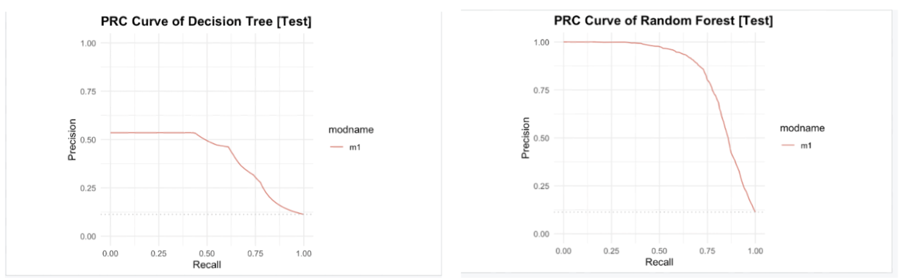
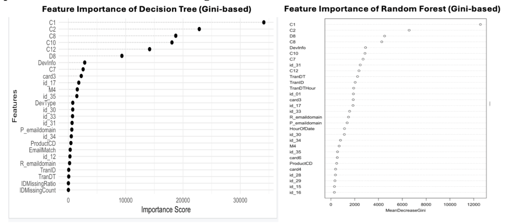

# Machine Learning Approaches to Online Transaction Fraud Detection

> A reproducible machine-learning case study that compares Decision Tree and Random Forest models for detecting fraudulent online transactions under class imbalance.

[](./Paper.pdf)


## Overview

Financial fraud detection is a highly imbalanced classification problem: fraudulent transactions are rare, but missing them can be costly. This project develops and evaluates two tree-based machine-learning models for online transaction fraud detection:

- **Decision Tree** — an interpretable baseline that produces understandable decision rules
- **Random Forest** — an ensemble model used to improve predictive stability and fraud-detection performance

The project places particular emphasis on **recall** and **area under the precision-recall curve (AUPRC)**. In fraud detection, identifying more true fraud cases is often more important than simply maximising accuracy, which can be misleading when non-fraud transactions dominate the dataset.

📄 **Read the full report:** [Paper.pdf](./Paper.pdf)

## Objectives

This case study aims to:

1. Build and compare Decision Tree and Random Forest classifiers for fraud detection.
2. Evaluate the models using metrics appropriate for imbalanced data.
3. Identify important predictors and interpret them in a financial-fraud context.
4. Discuss data-quality issues, operational considerations, and limitations beyond model performance.

## Methodology

```text
Raw transaction data
↓
Exploratory data analysis
↓
Missing-value / constant-feature handling
↓
Outlier analysis and conditional winsorisation
↓
Categorical binning and feature engineering
↓
Stratified 80:20 train-test split
↓
SMOTE applied to training data only
↓
Decision Tree vs. Random Forest
↓
Performance evaluation and feature-importance analysis
```

### Data preparation

The workflow includes:

- Separation of numerical and categorical attributes
- Median imputation for numerical variables
- A dedicated `miss` category for missing categorical values
- Removal of entirely missing and constant variables
- Conditional winsorisation for selected numerical outliers
- Binning high-cardinality categorical variables into frequent categories and `others`
- Stratified training-test partitioning with a fixed random seed of `7410`
- SMOTE applied only to the training set to avoid test-set leakage

Three behavioural features were additionally created:

| Feature | Description | Fraud-detection rationale |
|---|---|---|
| `HourOfDay` | Transaction hour derived from `TranDTHour` | Fraudulent activity may occur at unusual times |
| `EmailMatch` | Whether purchaser and recipient email domains match | Captures relationships within transaction ecosystems |
| `IDMissingRatio` | Proportion of missing identity-related fields | Missing identity information may be associated with elevated fraud risk |

## Evaluation

The models are evaluated on both training and held-out test data using:

- Accuracy
- Recall
- Precision
- F1-score
- AUROC
- AUPRC

For this project, recall and AUPRC are treated as the most decision-relevant metrics because they better reflect fraud capture and false-alert trade-offs under severe class imbalance.

## Key Findings

- The dataset is highly imbalanced, with non-fraud transactions substantially outnumbering fraud cases.
- Missingness, extreme values, and high-cardinality categorical variables require explicit preprocessing before modelling.
- Several count-based and identity-related variables show meaningful discriminatory value for fraud detection.
- The Random Forest outperformed the Decision Tree across the reported test-set metrics and provided a stronger precision-recall trade-off.
- Both models show signs of overfitting when comparing training and test performance, highlighting the need for careful validation and threshold selection in production settings.

## Selected Visuals
<p align="center">

</p>
<p align="center"><em>Precision-recall curves on the held-out test set.</em></p>

<p align="center">

</p>
<p align="center"><em>Gini-based feature importance for both models.</em></p>

## Repository Structure

```text
.
├── README.md                      # Project documentation
├── Paper.pdf                      # Full academic research report
├── sample.R                       # R script for preprocessing, SMOTE, training, and evaluation
└── assests/                       # Figures and visual assets
    ├── feature-importance.png     # Feature importance plot comparing models
    └── precision-recall-curve.png # Precision-recall evaluation curves
```

## Limitations and Future Work

This project is an academic case study rather than a production fraud-monitoring system. Potential extensions include:

- Cost-sensitive learning and threshold optimisation based on investigation capacity
- Hyperparameter tuning with cross-validation
- Temporal validation instead of a random split
- Gradient-boosting methods such as XGBoost, LightGBM, or CatBoost
- Probability calibration and model-drift monitoring
- Explainability methods such as SHAP values
- Fairness, privacy, and operational false-positive analysis

## Author
**Vincent Ng**  
MSc Candidate in FinTech and Data Analytics, The University of Hong Kong  
BEng in Computer Science, The Hong Kong University of Science and Technology

## Academic Note
This repository presents coursework completed for educational purposes. The report, code, and analysis should not be interpreted as investment, fraud-investigation, compliance, or production-deployment advice.
